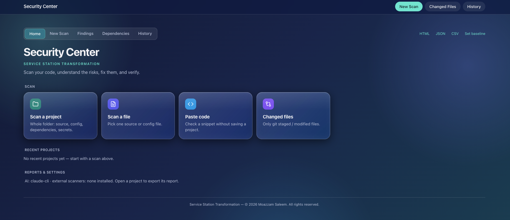

# Security Center

**A local security review tool for mobile and backend projects.**

It scans a project for secrets, vulnerabilities and misconfigurations, shows them in a dashboard by severity, and helps you fix them with optional AI assistance. Everything runs on your machine.

- **Supports:** Android (Kotlin/Java), Flutter (Dart), iOS (Swift), Node, Python, Go
- **Requires:** Node.js 18+ — no npm dependencies
- **Privacy:** the server listens on `127.0.0.1` only; scan data stays in your project folder, never in this repo

## Quick start

```bash
git clone git@github.com:moazzamsaleem66/SecurityCenter.git
cd SecurityCenter
node bin/secscan.js serve
```

Open http://localhost:4317, click **New Scan**, choose a project folder, file, or paste code, and scan.

Optional: install the Claude CLI (or set `ANTHROPIC_API_KEY`) to enable *Ask AI*, *Generate Fix* and AI review. Scanning itself is rule-based and uses no AI or tokens.

## Screenshots

Taken on the bundled demo project (`examples/demo-app`, dummy insecure code).

**Home**



**New Scan**


**Findings**


**Scan history**


### Example

Scanning the demo app produces findings like:

```
SEC-0010  CRITICAL  Firebase rules allow unauthenticated access          firestore.rules:1
SEC-0002  HIGH      Possible Keystore/Signing Password Exposed           android/app/build.gradle:1
SEC-0005  HIGH      android:debuggable="true"                            android/app/src/main/AndroidManifest.xml:2
SEC-0007  HIGH      Cleartext traffic enabled                            android/app/src/main/AndroidManifest.xml:2
SEC-0008  HIGH      Exported service without permission: .SyncService    android/app/src/main/AndroidManifest.xml:3
SEC-0003  HIGH      Insecure TLS Certificate Validation                  lib/network/api_client.dart:5
SEC-0001  HIGH      Sensitive data written to log                        lib/services/session_service.dart:2
```

Try it yourself: `node bin/secscan.js serve examples/demo-app`.

## Features

- **Dashboard:** severity donut, findings grid, dependencies, scan history with trend chart and scan comparison
- **Scan modes:** whole project, changed files only, single file, pasted code
- **Finding lifecycle:** open → reviewing → fixed → rescan → resolved; also false positive, accepted risk, ignored
- **AI fixes:** propose → diff → your approval → backup → apply → rescan → optional build check → undo
- **Reports:** JSON, CSV, HTML (print to PDF)
- **History:** kept 7 days per project (configurable), manual delete and clear-all available

## What it checks

| Area | Examples |
|---|---|
| Secrets | API keys, tokens, private keys, committed `.env` / keystores (always masked) |
| Network | TLS bypass, trust-all managers, cleartext HTTP/WS, ATS, network-security-config |
| Android | exported components, debuggable, backup, WebView, PendingIntent, signing |
| Flutter | secrets in SharedPreferences/Hive, WebView, local_auth, debug bypass flags |
| Crypto | ECB/DES, static keys/IVs, weak hashes in security context, weak random |
| Injection | SQL, command, eval, XSS |
| Auth / API | JWT handling, tokens in URLs, client-only authorization, CORS |
| Config | Firebase rules, Docker, GitHub Actions |
| Dependencies | known vulnerabilities via OSV.dev (pubspec, Gradle, npm, pip, Go, Maven) |

Debug-only code and test/example files are down-ranked or skipped (except for secrets).

## Commands

```bash
node bin/secscan.js serve [path]          # dashboard
node bin/secscan.js scan <path>           # CLI scan: --changed --git-history --ai --no-external --fail-on high --json out.json
node bin/secscan.js staged <path>         # pre-commit secret check (install-hook wires it up)
node bin/secscan.js install-claude <path> # add Claude Code agents, skill and /security-scan to a project
npm test                                  # self-check
```

## Rules of the workflow

- A finding is **Resolved only after a rescan** confirms it.
- AI changes are never applied without explicit approval, and can be undone.
- False positive and accepted risk require a reason; accepted risks stay in reports and expire for review.
- Finding IDs (`SEC-0001`…) stay stable when code moves.
- A failed scanner step (e.g. OSV offline) is reported, never treated as "no findings".

## Configuration

Optional `<project>/.secscan/config.json`:

```json
{ "exclude": ["legacy/"], "build": "flutter analyze", "retentionDays": 7 }
```

## AI and external tools

`src/ai.js` supports `claude-cli` (default if `claude` is on PATH) and `anthropic-api`. Override with `SECSCAN_AI` and `SECSCAN_MODEL`. Semgrep, Gitleaks, Trivy and OSV-Scanner are used automatically when installed.

## Limitations

Detection is pattern and context based, not data-flow analysis — treat low-confidence findings as prompts to look, and a score of 100 as "nothing matched", not "secure". Claude CLI/API calls and external-tool output converters are not covered by the self-test; OSV lookups are tested against a stub.

---

© 2026 Moazzam Saleem. All rights reserved.
